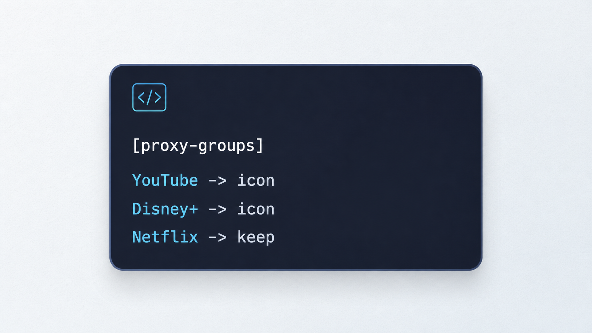

# Policy Icon Patch



一个轻量的图标处理工具，支持 Clash / Stash 与 Surfboard 配置。

在线使用：

[https://bol609619914-design.github.io/clash-icon-patch/](https://bol609619914-design.github.io/clash-icon-patch/)

## 它解决什么

有些机场订阅里的策略组没有图标信息，导入到支持策略组图标的客户端后，YouTube、Disney+、Netflix、OpenAI、Telegram 等分流组看起来会比较空。

这个工具会读取配置并按名称、server 域名匹配图标：

- Clash / Stash：给缺失 `icon` 的 `proxy-groups` 写入服务图标，也可以给 `proxies` 写入国家/地区旗帜
- Surfboard：解析 `[Proxy Group]` 与 `[Proxy]` 并导出图标映射清单，不向原配置写入未见官方支持的非标准字段

## 功能

- 支持粘贴 Clash YAML
- 支持粘贴 Surfboard / Surge 风格配置
- 支持上传本地 YAML / CONF 文件
- 支持尝试拉取订阅 URL
- 自动识别 Clash / Surfboard 格式
- 保留已有 `icon`
- 内置图标统一使用 Qure IconSet
- 支持节点国旗补齐，按节点名和 server 识别 HK、JP、SG、US、TW 等地区
- 预览补齐结果
- 一键复制或下载新的 YAML
- 纯静态网页，无后端服务

## 内置匹配

当前内置了常见策略组图标规则，包括：

YouTube、Disney+、Netflix、TikTok、Spotify、Telegram、OpenAI、GitHub、Google、Apple、Microsoft、Amazon、HBO Max、Hulu、Bahamut、Bilibili、Twitter/X、Instagram、Facebook、PayPal、Crypto、Steam/游戏、下载、代理选择、直连、广告拦截、兜底规则等。

## 使用方式

1. 打开在线页面。
2. 粘贴或上传 Clash YAML / Surfboard 配置。
3. 点击“处理配置”。
4. 检查预览结果。
5. 复制或下载处理后的 YAML / JSON。

## 隐私说明

这是一个纯前端静态工具，YAML 解析和图标补齐都在浏览器本地完成。

如果使用“订阅 URL”导入，浏览器会直接请求该订阅地址；很多订阅接口可能因为 CORS 策略无法在网页里直接读取，这时可以手动复制订阅返回内容，再粘贴到工具中处理。

## 本地运行

```bash
python3 -m http.server 4173
```

然后访问：

[http://127.0.0.1:4173/](http://127.0.0.1:4173/)

## 部署

本项目直接通过 GitHub Pages 从 `main` 分支根目录发布，不需要构建步骤。
